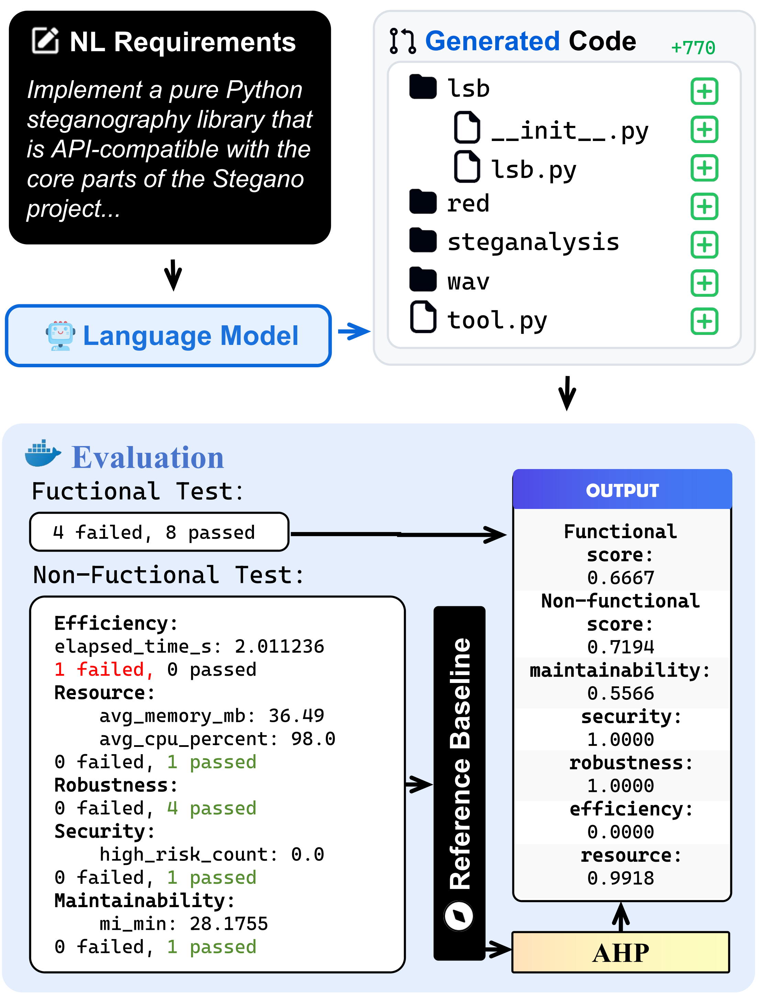

# Beyond Runnable: Are LLMs Ready for Application-Level Functional Correctness and Non-functional Quality?

RAL-Bench is an **application-level** benchmark that asks a simple but under-explored question:

> **Can current LLMs generate application-level repositories that satisfy functional correctness *and* non-functional quality?**

### Construction pipeline


### Evaluation pipeline


---

## What this repository provides (Contributions)

This repository contains the full artifact for RAL-Bench, including reference projects, task configs, system tests, and the end-to-end evaluation pipeline.

**Core contributions:**
- **Study:** We are the first to systematically analyze the evaluation gap between existing code benchmarks and the requirements of real-world application development. Our study also opens up a new research direction for precisely and rigorously evaluating application-level code generation.
- **Approach:** We propose RAL-Bench, a benchmark and evaluation framework for application-level code generation grounded in real-world GitHub repositories. For each task, we extract a concise natural-language requirement from a high-quality reference project and construct black-box system tests covering both functional correctness and key non-functional quality attributes. We execute all candidate tests on the reference repository and retain only those that pass, ensuring a sound test oracle and end-to-end executability. Functional score is computed as the system test pass rate. Non-functional quality is measured along five ISO/IEC 25010-inspired dimensions and aggregated using an AHP-derived weight vector with per-dimension diagnostics. In addition, baseline non-functional metrics are collected on the reference repository to enable baseline-normalized scoring.
- **Results:** We comprehensively evaluate 16 LLMs (standard and thinking) under zero-shot settings with greedy decoding. First, we find that functional correctness is the dominant bottleneck: under our requirement-driven, reference-validated black-box system tests, no LLM surpasses a 45\% functional pass rate. Second, although non-functional scores are generally higher, they cannot offset functional failures. Third, our failure-pattern dataset comprises 446 successfully generated repositories and over 4,500 test-case execution logs. It shows that failures are dominated by Requirement–Implementation Mismatch and Non-functional Quality Failures (82.8\% combined), whereas Executability \& Dependency Failures account for 17.2\%. Fourth, we quantify cost. Thinking LLMs are more expensive on average, yet they do not yield consistent functional improvements. This suggests that higher-cost “thinking” does not yet translate into effective reasoning for application-level generation。 Finally, the results show that when tasks scale to the application level, mainstream code generation strategies are no longer effective.

---


## Repository structure

The repository is organized around **(1) benchmark construction & execution**, **(2) task/test assets**, and **(3) experiment outputs**.

```
RAL-Bench/
├── 📂 Exp1/                 # RQ1: generated applications + evaluation artifacts/results
├── 📂 Exp2/                 # RQ2: evaluation artifacts/results
├── 📂 Exp4/                 # RQ4: evaluation artifacts/results
├── 📂 evaluation/            # Core pipeline: build benchmark + run end-to-end evaluation
├── 📂 repositories/          # Reference repositories (ground-truth code snapshots)
├── 📂 results/               # Results produced during evaluation runs (reports/logs/json/csv, etc.)
├── 📂 tasks/                 # Task configs + reference (baseline) values for non-functional metrics
├── 📂 tests/                 # System tests for all tasks (functional + non-functional)
├── 📂 scripts/               # Helper scripts (data prep / analysis / plotting / utilities)
├── 📂 tmp_perf/              # Temporary artifacts for performance measurement (cache/intermediate)
├── 📂 tmp_resource/          # Temporary artifacts for resource measurement (cache/intermediate)
├── 📂 .venv/                 # Local virtual environment
└── 📂 .converted/            # Local conversion/intermediate folder
```

### 📂 Key directories

- 📂 **`Exp1/`**  
  Stores **all applications generated for RQ1** and the **evaluation-produced artifacts** (e.g., per-run logs, intermediate files, per-task outputs).  
  This folder preserves *exact rerunnable* experimental traces for the RQ1 setting.

- 📂 **`evaluation/`**  
  The **main implementation** of the benchmark: constructing the benchmark view, executing end-to-end system tests, collecting metrics, and producing final scores/results.

- 📂 **`repositories/`**  
  Contains the **reference (ground-truth) code repositories**, typically pinned/snapshotted for reproducibility.

- 📂 **`results/`**  
  Stores **outputs generated during evaluation runs**, typically aggregated or summarized artifacts (e.g., final reports, consolidated CSV/JSON, and global logs).

- 📂 **`tasks/`**  
  Holds **per-task configurations** and the **reference values** used for non-functional metric baselines.

- 📂 **`tests/`**  
  All **system tests** for the tasks, including functional correctness tests and non-functional checks.


## Quickstart (2 steps)


### 1) Set API environment variables (PowerShell)
```powershell
$env:OPENAI_API_KEY="your_api_key"
$env:OPENAI_BASE_URL="your_base_url"
```

### 2) Run all benchmarks for a model
```powershell
python -m evaluation.run_all_benchmarks --model <model>
```


