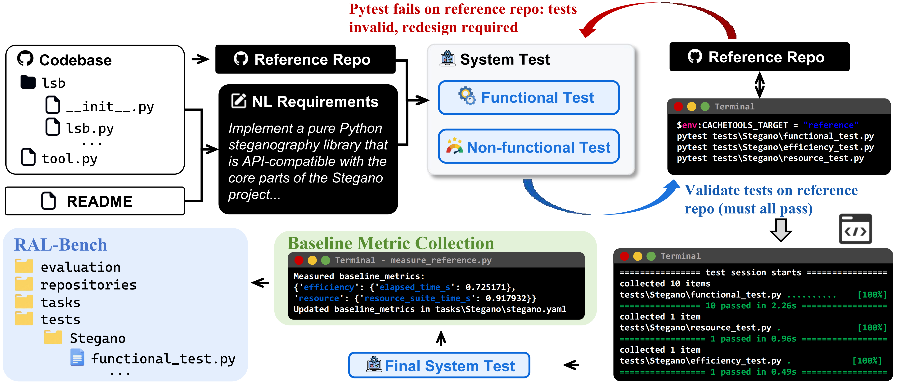

# RAL-Bench: Interface-Anchored Evaluation of Application-Level Repository Generation

RAL-Bench evaluates whether a model can generate a complete Python repository that installs, imports, runs, and satisfies tested behavior. Each task is derived from a real project at a pinned commit. The model receives a concise natural-language requirement and the public module/package surface used by the tests, but not the reference implementation or its private structure.



## Released benchmark editions

This artifact separates the benchmark version evaluated in the paper from two
extensions discussed in the paper:

| Edition | Role in the paper | Contents in this artifact | Intended use |
|---|---|---|---|
| **RAL-Bench (paper version)** | The benchmark used for all reported paper results | 38 Python tasks under `tasks/`, `tests/`, and `repositories/` | Reproducing the paper's tables, analyses, and model comparisons |
| **RAL-Bench-Fresh** | The temporally fresh version introduced in the data-contamination discussion | 50 repositories created on or after September 1, 2026, under `fresh/` | Evaluating temporal generalization on projects released after all models evaluated in the paper |
| **RAL-Bench-Pro** | The larger extension proposed in the benchmark-scope discussion | 200 Python tasks with explicit difficulty labels, distributed as `RAL-Bench-Pro.zip` | Broader and more difficulty-stratified evaluation beyond the 38-task paper set |

Results from these editions are not interchangeable: every result should name
the edition and task count used. Unless explicitly marked **Fresh** or **Pro**,
“RAL-Bench” and all numerical results in the paper refer to the 38-task paper
version. The packaged Pro release currently expands the number of projects and
adds difficulty labels while remaining Python-only; the additional-language
extension mentioned as future work in the paper is not claimed by this artifact.

## Shared benchmark protocol

The paper version contains 38 tasks across seven application scenarios: tooling, data, web, security, automation, observability, and content. Reference repositories range from 0.3k to 109.5k lines of code. Fresh and Pro preserve the same interface-anchored principle: requirements and public surfaces are benchmark inputs, while tests exercise externally observable behavior without depending on private reference structure.

Each task is constructed in five stages:

1. Select an actively maintained project with documented, locally testable public behavior and pin one commit.
2. Write a concise requirement and manually review the public surface.
3. Build black-box system tests from documented behavior and usage examples. Tests call only the declared public surface.
4. Retain a test only if it passes on the pinned reference repository and is stable without external services.
5. Measure the reference repository to store task-specific non-functional baselines.

Evaluation first checks installation and imports, then reports tested functional behavior and five separate ISO/IEC 25010-inspired diagnostic signals:

- **Functional:** pass rate of the retained functional system tests.
- **Maintainability:** lower-bound Maintainability Index, smoothly normalized against the reference; reference parity is `0.5`.
- **Security risk:** inverse ratio of high-risk static findings, relative to the reference.
- **Robustness:** pass rate on invalid, boundary, and unexpected inputs.
- **Efficiency:** reference-to-generated elapsed-time ratio, capped at `1`; a failed suite receives `0`.
- **Resource usage:** reference-relative RSS memory and, when available, CPU usage, capped at `1`.

The five non-functional values are diagnostics, not a substitute for functionality and not a single cross-dimensional quality score. A small or empty repository can score well on some static signals, so they must be interpreted together with the functional score.


## Paper results represented by this artifact

The paper evaluates 16 LLMs from four providers in a zero-shot, single-turn setting, plus three one-step strategies and four agentic workflows. No evaluated single-turn model exceeds a 45% functional score; the strongest evaluated agentic configuration reaches 58.76%. In the manually analyzed run, 82.8% of failed repositories fail after becoming executable, through requirement--implementation mismatch or non-functional quality failure.

The three one-step strategies are implemented as:

- `S1`: one feedback-driven repair using model-generated tests;
- `S2`: automated dependency/environment preparation;
- `S3`: an explicit planning pass before repository generation.

## Repository layout

```text
RAL-Bench/
|-- evaluation/          # Baseline, S1--S3 generation, measurement, and scoring
|-- tasks/               # 38 requirements, public surfaces, suite paths, and baselines
|-- tests/               # Reference-validated functional and diagnostic suites
|-- repositories/        # Pinned reference snapshots for the paper benchmark
|-- scripts/             # Reference validation and Fresh-50 construction
|-- artifacts/           # Compact RQ1, RQ2, and RQ4 tables/analysis outputs
|-- fresh/               # RAL-Bench-Fresh: 50 post-cutoff tasks and validation evidence
|-- pic/                 # Paper pipeline figures
|-- RAL-Bench-Pro.zip    # RAL-Bench-Pro: packaged 200-task extension
|-- requirements.txt
`-- README.md
```

Local environments, generated repositories, pytest logs, caches, and repeated per-run outputs are intentionally excluded.

## Setup

Python 3.9 or later is recommended.

```powershell
python -m venv .venv
.\.venv\Scripts\Activate.ps1
python -m pip install -r requirements.txt
```

For generation, set an OpenAI-compatible endpoint:

```powershell
$env:OPENAI_API_KEY = "your_api_key"
$env:OPENAI_BASE_URL = "https://your-compatible-endpoint/v1"  # optional
```

## Reproduce the paper benchmark

Validate and refresh all 38 reference baselines:

```powershell
python scripts/run_all_reference.py
```

Generate and evaluate all tasks with the baseline protocol:

```powershell
python -m evaluation.run_all_benchmarks --model <model-id>
```

Evaluate repositories that already exist under `generation/<Task>/`:

```powershell
python -m evaluation.run_all_benchmarks --model <label> --skip-generation
```

Run one paper strategy by replacing `s1` with `s2` or `s3` as needed:

```powershell
python -m evaluation.run_all_benchmarks_s1 --model <model-id>
```

Generated repositories and result logs are ignored by Git to keep the artifact compact and anonymous.

## RAL-Bench-Fresh (50 tasks, October 2026)

`fresh/manifest.json` freezes 50 Python repositories created on or after **2026-09-01**, after the release of the evaluated models. Every entry is pinned to a 40-character commit and was checked for a README, Python source, packaging metadata, and an upstream test suite. Source eligibility and six-suite interface validation are both **50/50 passed**.

Rebuild and revalidate the frozen source set:

```powershell
python scripts/build_fresh_benchmark.py
```

Upstream tests are used only as an eligibility signal; they are never treated
as RAL-Bench tests. The release includes per-task requirements, public surfaces,
benchmark-authored interface and robustness tests, reference runs, and frozen
non-functional baselines. All 50 tasks also contain documentation-grounded cases for typical inputs,
expected outputs, state changes, and exceptional boundaries. Both the semantic
execution report and the reproducible second-pass review are **50/50 passed**.
Fresh is therefore ready for automated evaluation under its frozen protocol.
The manifest deliberately retains `semantic_review_complete: false` because the
second pass was performed by the benchmark maintainer and should not be reported
as the separate professional-developer validation conducted for the 38-task
paper version.

## RAL-Bench-Pro (200-task extension)

`RAL-Bench-Pro.zip` is the larger extension corresponding to the paper's
RAL-Bench-Pro discussion. It contains 200 task specifications and their
black-box functional, robustness, performance, resource, maintainability, and
security checks. Pro adds explicit task difficulty labels and substantially
broadens project coverage, but it is not the benchmark used to produce the
paper's reported model scores.

Keep Pro results separate from both the 38-task paper version and Fresh-50, and
report them as **RAL-Bench-Pro (200 tasks)**. The current archive is a Python
release; it should not be described as providing the additional programming
languages identified as a future Pro direction in the paper.

